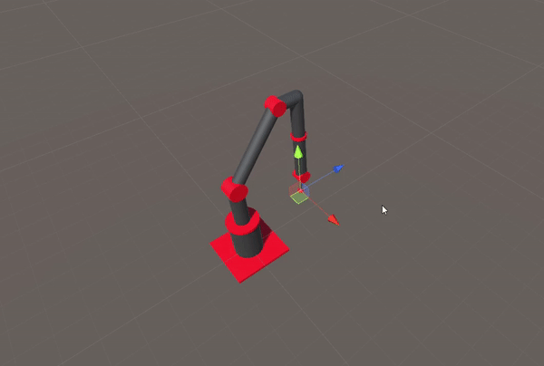

# Inverse-Kinematics

Implementation of a forward kinematics simulation to visualize the motion of the robot and an iterative inverse kinematics algorithm to calculate net joint velocities in a rigid body linked segment robot.

